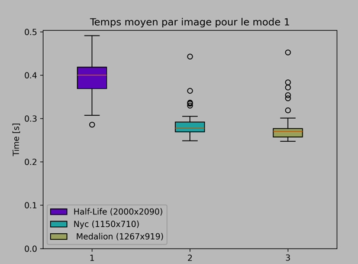
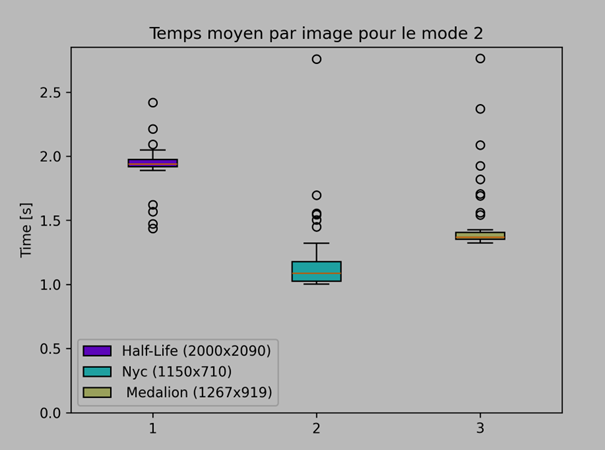
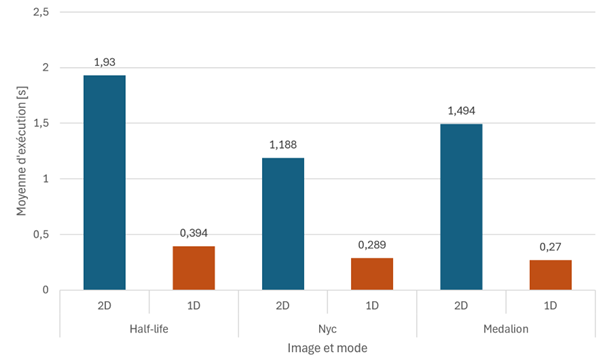

# HPC – Labo 1

Auteur : Kevin Ferati

# Introduction

Ce rapport compare le temps de détection de l’outil de détection de bordure et analyse les résultats obtenus.

# Matériel et logiciels utilisés lors des mesures

## Matériel

| Fabricant | Lenovo |
| --- | --- |
| Modèle | P16s Gen 2 (21HK000UMZ) |
| Processeur | Intel i7-1360p<br><br>2'200 MHz<br><br>12 cœurs, 16 processeurs logiques |
| RAM | 32 Go à 4800 MHz |
| Taille des caches | L1 : 80 KB / coeur<br><br>L2 : 2 MB / cœur<br><br>L3 : 18 MB / partagé |

## OS

Windows 11 Pro

## Commandes de compilation

L’exécutable utilisée pour les mesures a été créée à l’aide de la commande _make lab01_, soit :
```
gcc -O3 -g -Wall -I../../lib/stb/ -I../include -fno-inline -o image.o -c image.c
gcc -O3 -g -Wall -I../../lib/stb/ -I../include -fno-inline -o main.o -c main.c
gcc -O3 -g -Wall -I../../lib/stb/ -I../include -fno-inline -o sobel.o -c sobel.c
gcc -o lab01 image.o main.o sobel.o -lm
```
## Outil de mesure

Hyperfine v1.18.0

## Autre

Un antivirus (Sophos) est présent sur l’ordinateur réalisant ces mesures avec des paramètres de sécurité et d’analyse très agressives pouvant donc impacter les mesures, entre autres durant le chargement et la sauvegarde des images. Pour différentes raisons, il m’est impossible de le désactiver.

# Méthodologie

Chaque mesure a été réalisée avec les paramètres de performance au maximum pendant que le PC portable était en train de charger.

La détection de bordure est effectuée 40 fois – soit une valeur assez grande pour être le moins influencé par des interférences extérieures possibles - entre les modes 1 et 2. Je prendrai ensuite la moyenne de ces itérations et comparerai les différents résultats.

Afin d’éviter des biais liés à des éventuels cache, les benchmarks auront une première phrase de _warmup_ de 3 itérations.

Les tests seront exécutés sur 3 images de taille variables. Chaque mesure va produire un json contenant les résultats qui sera ensuite utilisé afin de produire les graphes d’analyse. Les graphiques seront générés à partir des scripts dans le repo d’hyperfine.

# Résultats de l’exécution des programmes

## Half-life


## Medalion


## NYC

# Mesures

## Mode 1d

Commande :

`hyperfine --runs 40 --warmup 3 --export-json "results-1.json" --parameter-list file "half-life,nyc,medalion" "./lab01.exe ../images/{file}.png ../{file}.png 1`



| Image | Moyenne \[s\] | Min \[s\] | Max \[s\] |
| --- | --- | --- | --- |
| Half-life | 0.394 | 0.286 | 0.492 |
| Nyc | 0.289 | 0.249 | 0.443 |
| Medalion | 0.270 | 0.247 | 0.453 |

## Mode 2d


Commande : 
`hyperfine --runs 40 --warmup 3 --export-json "results-2.json" --parameter-list file "half-life,nyc,medalion" "./lab01.exe ../images/{file}.png ../{file}.png 2`

| Image | Moyenne \[s\] | Min \[s\] | Max \[s\] |
| --- | --- | --- | --- |
| Half-life | 1.930 | 1.437 | 2.419 |
| Nyc | 1.188 | 1.001 | 2.759 |
| Medalion | 1.494 | 1.324 | 2.764 |

## Comparaison du temps d’exécution par image et algorithme

# Analyse

Sans grande surprise, nous pouvons observer une forte corrélation entre la dimension d’une image et le temps d’exécution nécessaire pour les deux modes. Half-life (le plus volumineux) prend toujours plus de temps a être traité que les autres images, peu importe le mode. Dans le mode 2D, Medalion a pris plus de temps que Nyc mais pas en 1D. Il est possible que cette différence soit due à des interférences ou de changement d’environnement lors des mesures.

Nous remarquons également que le mode 2D est toujours moins performant que le mode 1D, ceci dû entre autres au fait que plus d’itérations sont nécessaires dans ce mode et que les pixels ne sont pas contigus, générant beaucoup de _cache miss_.

La présence de plusieurs valeurs aberrantes montre la limite de cette analyse. Ces valeurs sont certainement dû à des interférences avec le programme, tel que l’anti-virus précédemment mentionné. Afin d’obtenir des résultats plus justes, d’autres mesures sur un système plus calme seraient pertinentes.