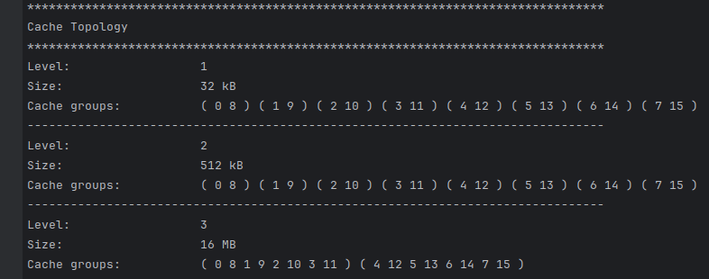
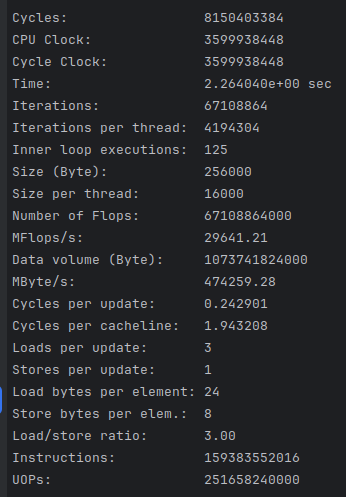

# Benchmarks

Topologie 

Caches
L1 32 KB  - L2 512 KB - L3 16MB

CPU : AMD Ryzen 7 3700x 8 coeur 3.6 GHz à 4.4 GHz / 2 Threads par coeur 

N pour tous les coeurs, 16 pour 16 threads
likwid-bench  -t stream -w N:500kB

On a 8 coeurs avec un cache de 32KB => Stream de 256KB
likwid-bench -t peakflops -W N:256KB

likwid-bench -t peakflops_avx -W N:256KB

Triad `a[i] = B[i] + C[i] * D[i]`
likwid-bench -t triad -W N:256KB

2ème :
MByte/s:                477301.43
 
 

likwid-bench -t triad -W N:2GB

likwid-bench -t triad -W N:4MB

likwid-bench -t triad_avx -W N:256KB
